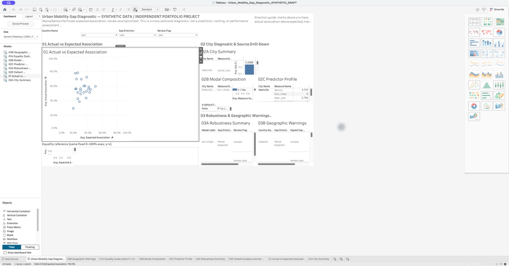

# Data Analytics Portfolio

[](https://github.com/binhnguyenhealth-maker/data-analytics-portfolio/actions/workflows/validate.yml)
[](LICENSE)
[](docs/FUTURE_TABLEAU_REBUILD_PLAN.md)

Three reproducible analytics case studies built with deterministic synthetic
data, fail-closed validation, and downloadable Tableau workbooks.

> **SYNTHETIC DATA / INDEPENDENT PORTFOLIO PROJECT**
> These are independent prototypes, not client-commissioned work or evidence
> of production deployment.

## Portfolio at a glance

| Project | Decision supported | Technical signature | Open in Tableau |
|---|---|---|---|
| [Data Quality Command Center](projects/data-quality-command-center/) | Which data-quality issues block a refresh, in what order, and with what lineage evidence? | multi-source reconciliation, governed priority queue, relationship QA | [Download workbook](projects/data-quality-command-center/tableau/Data_Quality_Refresh_Command_Center_SYNTHETIC_PORTFOLIO.twbx) |
| [Urban Mobility Gap Diagnostic](projects/urban-mobility-gap/) | Which fictional cities diverge from a frozen benchmark, and are those gaps robust? | single-root presentation model, scatter/equality reference, sensitivity checks | [Download workbook](projects/urban-mobility-gap/tableau/Urban_Mobility_Gap_Diagnostic_SYNTHETIC_PORTFOLIO.twbx) |
| [Peer Scenario Explorer](projects/peer-scenario-explorer/) | Which five fictional peers match a focal city, why, and how stable is the set? | scenario parameters, explainable distance allocation, stability testing | [Download workbook](projects/peer-scenario-explorer/tableau/Peer_Scenario_Stability_Explorer_SYNTHETIC_PORTFOLIO.twbx) |

## Dashboard previews

### 1. Data Quality Command Center

[](projects/data-quality-command-center/)

### 2. Urban Mobility Gap Diagnostic

[](projects/urban-mobility-gap/)

### 3. Peer Scenario Explorer

[](projects/peer-scenario-explorer/)

## Reproduce the data and tests

```sh
python3 -m pip install -r requirements.txt
python3 shared/validation/regenerate_all.py
python3 shared/validation/run_all_tests.py
```

The generators are deterministic across fresh Python processes and multiple
`PYTHONHASHSEED` values. The test suite covers analytical contracts,
disclosure boundaries, entity provenance, package structure, embedded-source
byte equality, and negative fixtures.

## Repository design

```text
projects/<case-study>/
  src/          deterministic generator and validator
  tests/        positive and mutation-based negative cases
  tableau/      downloadable packaged workbook
  images/       native Tableau preview
shared/
  synthetic/    fictional entity pools and seeded primitives
  validation/   aggregate, disclosure, structure, and package gates
docs/           architecture, disclosure, and native build contract
validation/     current release record and inclusion manifest
```

## What this demonstrates

- decision-first dashboard design rather than chart-first decoration;
- deterministic, testable data generation with explicit data contracts;
- Tableau Desktop authoring with fixed layouts and visible disclosures;
- analytical integrity controls for joins, denominators, leakage, scenarios,
  and robustness; and
- honest boundaries around synthetic data, deployment, and business outcomes.

## Important limitations

- All people, places, organizations, identifiers, and values are fictional.
- The workbooks were validated locally in Tableau Desktop 2026.2 Free Edition.
- Tableau Optimizer was visible but disabled in that edition.
- The workbooks do not demonstrate hosted administration, row-level security,
  scheduled refresh operations, training delivery, or measured client impact.

See [SOURCE_AND_USAGE_POLICY.md](SOURCE_AND_USAGE_POLICY.md),
[docs/DISCLOSURE_MATRIX.md](docs/DISCLOSURE_MATRIX.md), and
[validation/VALIDATION.md](validation/VALIDATION.md) for the exact evidence
boundary.

## License

Apache License 2.0. See [LICENSE](LICENSE) and [NOTICE](NOTICE).
