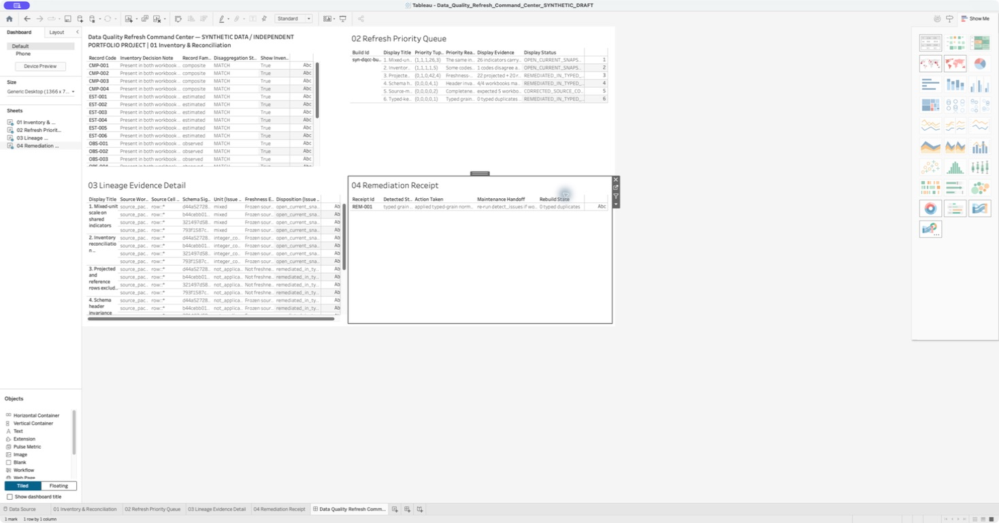

# Data Quality Refresh Command Center

**SYNTHETIC DATA / INDEPENDENT PORTFOLIO PROJECT**



[Download the packaged Tableau workbook](tableau/Data_Quality_Refresh_Command_Center_SYNTHETIC_PORTFOLIO.twbx)

## Decision supported

Every refresh cycle, a data operations lead uses this command center to decide
which source-quality issue must be resolved first, using a reconciled source
inventory, typed issue register, lineage evidence, and remediation readback.

## Why it is useful

The dashboard turns four common quality-control questions into one governed
workflow:

1. Which expected inputs are present or missing?
2. Which current issue blocks publication first?
3. What source evidence supports that issue?
4. Did the remediation survive a same-operation rebuild and readback?

## Technical highlights

- deterministic generation from fictional source-workbook inventories;
- explicit issue grain and typed duplicate detection;
- lexicographic priority rules with documented evidence fields;
- a one-to-many issue-to-lineage relationship with orphan checks;
- display-only detail parameter that does not change row counts; and
- positive and mutation-based negative tests for stale, malformed, and
  contradictory states.

## Tableau surfaces

- `01 Inventory & Reconciliation` — 27 synthetic inventory rows
- `02 Refresh Priority Queue` — 6 governed issue rows
- `03 Lineage Evidence Detail` — 25 lineage rows
- `04 Remediation Receipt` — 1 same-operation readback row

The packaged workbook uses a fixed 1366 x 768 dashboard and embeds only the
four generated CSV inputs needed by these views.

## Rebuild and validate

```sh
python3 src/generate.py
python3 src/validate.py
python3 -m unittest tests/test_dqcc.py
```

Run commands from the repository root when using the aggregate suite described
in the top-level README.

## Evidence boundary

This prototype demonstrates data modeling, refresh governance, lineage, and
Tableau presentation. It does not claim production operation, client
acceptance, or measured organizational outcomes.
