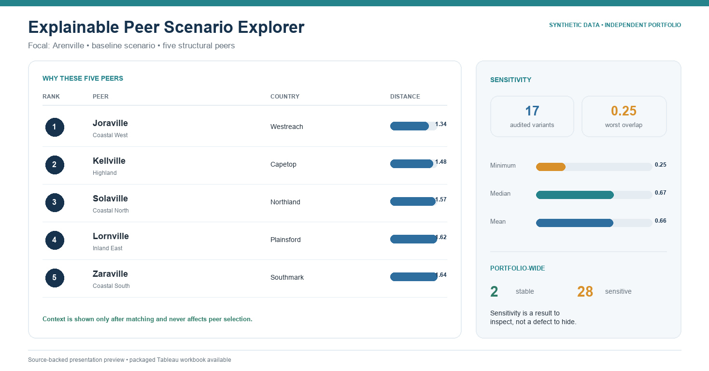

# Explainable Urban Peer Scenario Stability Explorer

**SYNTHETIC DATA / INDEPENDENT PORTFOLIO PROJECT**



[Download the packaged Tableau workbook](tableau/Peer_Scenario_Stability_Explorer_SYNTHETIC_PORTFOLIO.twbx)

## Decision supported

Every benchmarking cycle, a strategy analyst uses this explorer to choose five
structurally similar fictional peers for a focal city, understand why each peer
was selected, and determine whether the set is stable enough to use.

## Analytical boundary

Peer matching uses only synthetic structural features. Context values are
displayed after matching and are never used in the distance calculation. The
dashboard uses a complete non-map roster because no coordinate source is part
of the model.

## Technical highlights

- 30 fictional cities and three scenario policies;
- fold-local robust scaling and explicit distance components;
- closest and country-diversified peer sets;
- signed per-feature contributions and nonnegative allocation checks;
- 17 perturbation variants with Jaccard stability measures;
- coverage and representation diagnostics; and
- focal-city and scenario parameters with a deterministic landing state.

## Tableau surfaces

- `01 Focal City + Five Peers`
- `02 Why This Peer`
- `03 Closest vs Diversified`
- `04 Context After Matching`

The default state opens to a synthetic focal city and the baseline scenario.
Changing either control updates the corresponding explanation and context
surfaces without introducing map fields or outcome leakage.

## Rebuild and validate

```sh
python3 src/generate.py
python3 src/validator.py projects/peer-scenario-explorer/data/synthetic
python3 -m unittest tests/test_pse.py
```

## Evidence boundary

This prototype demonstrates explainable matching, scenario design, stability
testing, and Tableau parameter interaction. It does not claim that any peer
set is objectively correct or that the method was deployed for a client.
